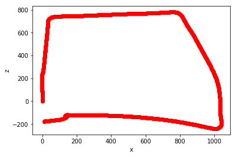
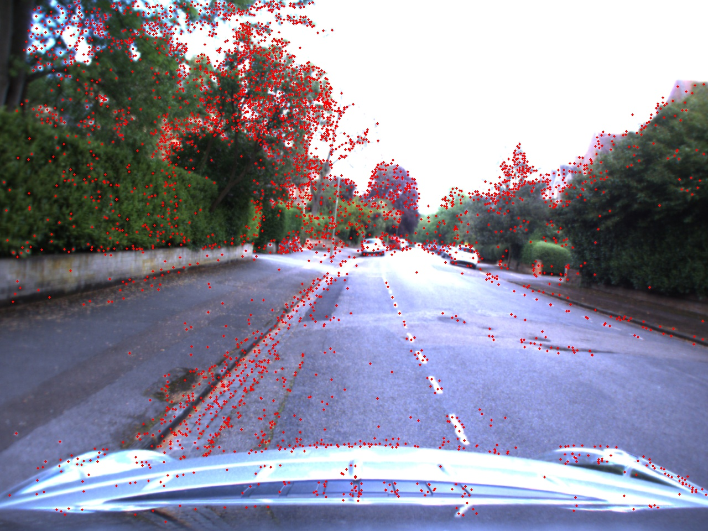
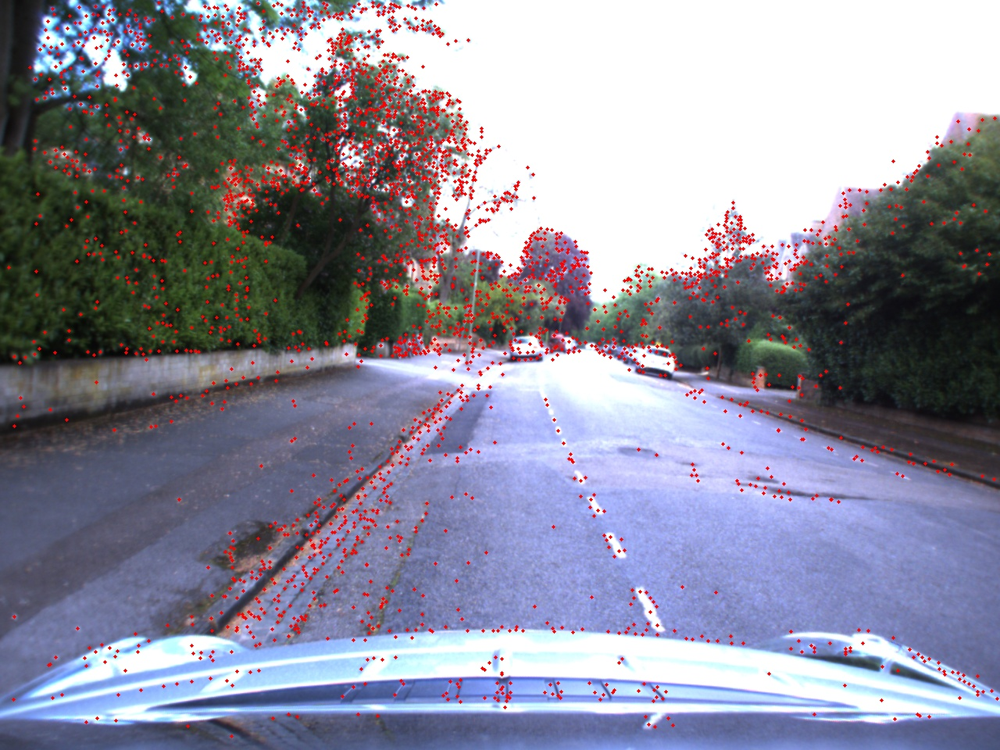

# Structure from Motion


### Author
Arpit Aggarwal


### Camera Trajectory Plot



### Example of Keypoints between successive frames





### Instructions for running the code
To run the code, follow the following commands:

```
python Code/main.py 'images_path'
```
where, images_path is the path for the images. For example, running the python file on my local setup was:

```
python Code/main.py /home/arpitdec5/Desktop/structure_from_motion/data/stereo/centre
```


### Software Required
To run the .py files, use Python 3. Standard Python 3 libraries like OpenCV, Numpy, scipy, and matplotlib are used.
